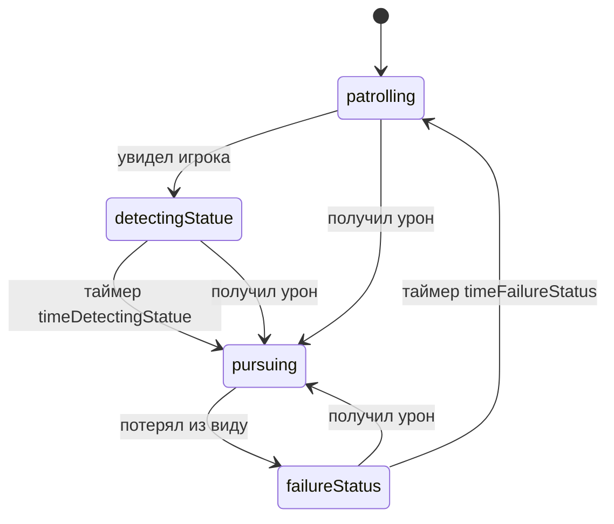

# Враги

`Enemy` — пустой абстрактный MonoBehaviour. Живые реализации: патрульный и пушка.

## Патрульный (`Patroller`)

FSM на `StateMachine<Patroller>`, стартовое состояние — патруль. Настройки: `PatrollerSettings`.

Зрение — `EnemyEyes` (Inject героя как цель). Раз в 0.1 с:

1. Угол между «вперёд» (`parent.localScale.x`) и вектором на героя должен быть меньше `_viewingAngle` (в коде сравнение в градусах: `angle < viewingAngle * Rad2Deg`).
2. Raycast по `_trackedLayers` на `_viewingRange`.
3. Попадание в `Rigidbody2D` героя → `isVisible`, событие `isVisibleChange`.

`SetViewingDate(range)` / `(range, angle)` меняет конус. На патруле: дальность 5, угол π/4. В погоне: 10 и π (почти круговой обзор).

Край платформы: `LayerCheck` `GroundArea`. Нет земли впереди — разворот (патруль) или стоп (погоня).

Над головой `SpeechWindow` (TMP): текст состояния, зеркалится вместе с `RotateView`.

### Состояния

| Состояние | Поведение | Реплика |
|-----------|-----------|---------|
| `PatrollingStatus` | Ходит по X со `patrollingSpeed`, разворот на краю, смотрит конусом | «и где же он...» |
| `DetectingStatue` | Стоит `timeDetectingStatue` | «нашел!» |
| `PursuingStatus` | Смотрит почти на 360°, идёт к игроку; на дистанции &lt; 1 — `weapon.Attack()` | «щас получишь...» |
| `FailureStatus` | Ждёт `timeFailureStatus`, затем снова патруль | «:C» |
| `AttackingState` | Пустышка, в `Patroller` не создаётся | — |
| `AttackedStatus` | База: любой `OnHealthChange` → `pursuing` | — |

Движение патрульного — не физика, а запись `transform.position.x` (`MovePatrollerStatus.SetAndRotateX`).

`PatrollingStatus.FixedUpdate` вызывает `base.LogicUpdate()`, а не `FixedUpdate` родителя.

## Пушка (`Cannon`)

Не Enemy. Зона `LayerCheck`: игрок вошёл — корутина стрельбы каждые 0.5 с (`SetSpeedShootingÑycle` может сменить интервал), вышел — `StopAllCoroutines`.

Баллистика на фиксированное `_flightTime`: считает `vx, vy` с учётом `_gravityScale` и горизонтальной скорости цели (`vy` цели берётся 0). Пуля из `Pool` (`Bullet` : `ElementPool`), ей ставятся velocity и gravityScale.

Старый решатель полинома времени полёта оставлен в `#region legasy`.

Попадание: см. [HealthAndDamage.md](HealthAndDamage.md) (`Bullet` + `HealthPointCheck`). Префабы: `Prefabs/NPC/Cannon/`.
