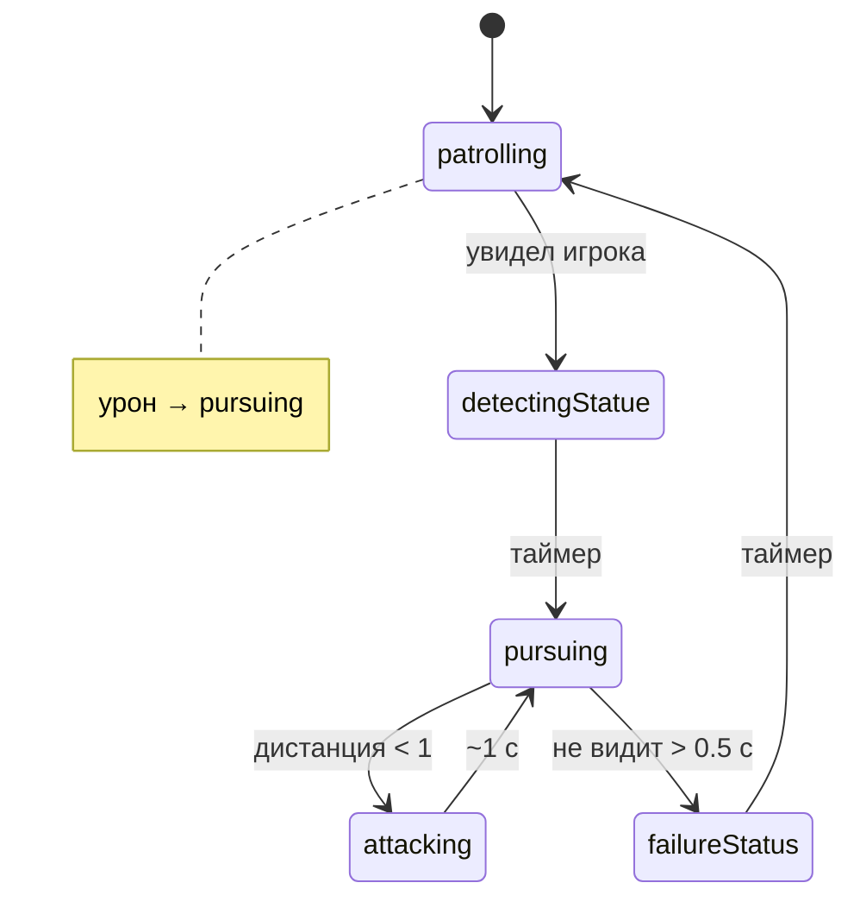

# Враги

`Enemy` — пустой абстрактный MonoBehaviour. Живые типы: патрульный и пушка.

## Патрульный (`Patroller`)

Своя `StateMachine<Patroller>`, старт — патруль. Настройки: `PatrollerSettings`. Есть `Animator` (`MovingBlend`, триггер `Attack`).

Зрение — `EnemyEyes` (Inject героя). Раз в 0.1 с:

1. Угол между «вперёд» (`parent.localScale.x`) и вектором на цель `< viewingAngle * Rad2Deg` (`viewingAngle` задаётся в радианах).
2. Raycast по `_trackedLayers` на `_viewingRange`.
3. Попадание в Rigidbody2D героя → `isVisible` / `isVisibleChange`.

Цель берётся из `_targetRigidbody.position`. На патруле: дальность 5, угол π/4. В погоне: 10 и π.

Край платформы: `LayerCheck GroundArea` (`InLayer`). Нет земли — разворот (патруль) или стоп (погоня).

`SpeechWindow` над головой, зеркалится с `RotateView`.

Движение — запись `transform.position.x`, не физика.

### Состояния

| Состояние | Поведение | Реплика / аним |
|-----------|-----------|----------------|
| `PatrollingStatus` | Ходит, разворот на краю, конус зрения | «Патрулирование», MovingBlend 0.5 |
| `DetectingStatue` | Стоит `timeDetectingStatue` | «Найден», blend 0 |
| `PursuingStatus` | Обзор ~360°, идёт к цели; 0.5 с «слепоты» до failure | «Преследование», blend 1 |
| `AttackingStatus` | Триггер Attack, на 0.3 с `weapon.DealingDamage()`, через 1 с назад в pursue | blend 0 |
| `FailureStatus` | Ждёт `timeFailureStatus` | «Потерян» |
| `AttackedStatus` | База: `OnHealthChange` → pursuing, если ещё не там | — |

## Пушка (`Cannon`)

Не Enemy. `LayerCheck`: игрок вошёл — стрельба каждые 0.5 с, вышел — `StopAllCoroutines`.

Баллистика на фиксированное `_flightTime`: `vx, vy` с `_gravityScale` и горизонтальной скоростью цели (`vy` цели = 0). Пуля из `Pool`. Попадание и земля — [HealthAndDamage.md](HealthAndDamage.md).

Префабы: `Prefabs/NPC/Cannon/`.
