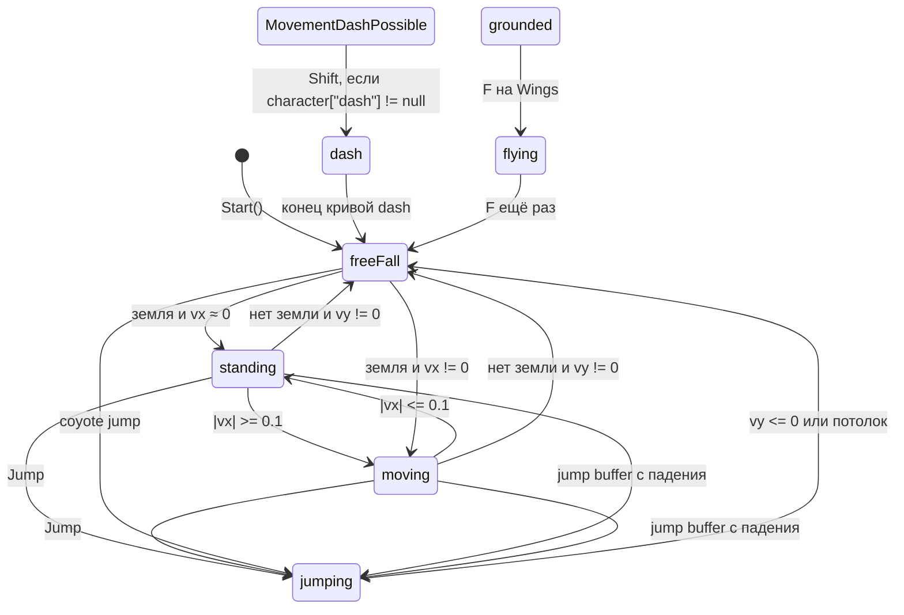

# Мувмент героя

Герой — `Character` + `Rigidbody2D` + Animator. Логика движения живёт в FSM, числа — в `PlayerSettings` (`Assets/Settings/PlayerSettings.asset`).

Камера следует за героем через `Follow` (Lerp в `LateUpdate`, offset X/Y).

## Иерархия состояний

```
State<Character>
 └── BaseCharacterState          # rb, settings, InputService, OnEnter/OnExit
      ├── LockableState          # флаг блокировки повторного входа
      │    └── DashState
      └── RotatableState         # поворот спрайта по horizontalInput
           └── AttackableState   # ЛКМ → Character.Attack()
                ├── FlyingState  # полёт (крылья)
                └── MovementPossibleState          # ходьба по горизонтали
                     └── MovementDashPossibleState # Shift → dash, если состояние есть
                          ├── GroundedState
                          │    ├── StandingState
                          │    └── MovingState
                          ├── JumpingState
                          └── FreeFallState
```

Реестр ключей — `DictionaryStates`. Создаётся в `Character.Construct`. Индексатор `character["moving"]` возвращает `null`, если ключа нет (смена состояния тогда тихо отменяется в `StateMachineEvents`).

Зарегистрированы при старте: `standing`, `jumping`, `freeFall`, `moving`.

**Не** регистрируются при старте: `dash` (выдаёт алтарь) и полёт (создаёт `Wings` локально, не кладёт в словарь).

## Переходы



`LockableState`: пока `LockState == true`, вход в это состояние отменяется (`Character.OnChangeLockableState`). Dash после выхода ставит лок, пока не истечёт `delayedDash` **и** герой снова на земле.

## Горизонтальное движение

`MovementPossibleState.Move()` в `FixedUpdate`:

- Нет ввода или ввод против скорости → торможение `reverseAcceleration` через `SetVelocityX(MoveTowards(...))`.
- Ввод по направлению:
  - до половины `maxSpeedX` — `startDirectAcceleration`;
  - дальше — `directAcceleration`;
  - сила режется так, чтобы не перескочить `maxSpeedX`;
  - применяется `AddForce(..., Impulse)`.
- Если скорость уже выше капа — сила против знака скорости.

В ассетe сейчас: `maxSpeedX = 8`, `reverseAcceleration = 50`, `directAcceleration = 4`, `startDirectAcceleration = 20`.

Поворот: `RotatableState` каждый `LogicUpdate` кормит `RotateView` значением `horizontalInput`.

## Прыжок и падение

`JumpingState.Enter`: обнуляет `vy`, импульс вверх `forceJump` (17).

`FreeFallState`:

- На входе ставит `gravityScale = gravityScaleDown` (6.5), на выходе восстанавливает.
- При `vy < 0` — `gravityScaleDown`, иначе `gravityScaleUp` (4) — падение быстрее подъёма.
- Кап падения: `maxSpeedY` (25).

### Coyote time

Если предыдущее состояние было `GroundedState`, герой ещё в воздухе меньше `delayedJumpTime` (0.12 с) и нажат прыжок — переход в `jumping`.

### Jump buffer

В падении запоминается `(wasPressed, Time.time)`. При входе в `GroundedState`, если нажатие было не старше `timeDelayedPressin` (0.1 с) — сразу прыжок.

## Dash

Состояние создаётся только алтарём `AltarDash` (клавиша F в зоне):

```csharp
character["dash"] = new DashState(...);
```

Пока ключа нет, Shift ничего не делает (`ChangeState(null)` игнорируется).

В dash: гравитация 0, `vy = 0`, скорость по X = `направление * dashSpeedCurve.Evaluate(t)`. Длительность — время последней ключки кривой. Выход всегда в `freeFall`. КД: `delayedDash` (0.2 с) + касание земли.

## Полёт

`Wings` создаёт `FlyingState` и по F переключает на него. Повторный F в полёте → `freeFall`.

На входе гравитация 0. Применение скорости в `FixedUpdate` закомментировано: персонаж зависает. Оси ввода в `HandleInput` перепутаны (`verticalInput = move.x`, `horizontalInput = move.y`).

## Анимация

Параметры Animator, которые пишет код:

- `IsGrounded` — с `LayerCheck` земли (`Character.Awake`)
- `MovingBlend` — `|vx| / maxSpeedX` (в moving) или `/ 12` (в `MovementPossibleState`)
- `SpeedVertical` — `vy`
- у `Hand`: триггер `Attack`

`AnimationInitialize` дублирует часть тех же параметров (земля, blend, vertical speed) — второй путь в аниматор.

## Отладка

`Character.OnGUI` показывает имя состояния, `Rigidbody2D.velocity` и ось Move.X.
