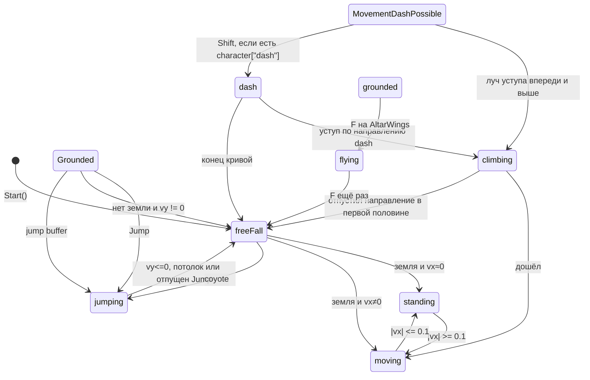

# Мувмент героя

`Character` + `Rigidbody2D` + Animator. Логика в FSM, числа в `PlayerSettings`.

Камера: `Follow` (Lerp, offset X/Y).

Земля и потолок: `LayerCheck.InLayer`. Уступ: `ClimbingDetectionSystem` (рейкаст вниз каждый FixedUpdate) → `Character.climbingHit`.

## Иерархия состояний

```
State<Character>
 └── BaseCharacterState            # rb, settings, input, timeToEnter; LogicUpdate → bool
      ├── LockableState
      │    └── DashState
      └── RotatableState           # поворот по horizontalInput (ось X)
           └── AttackableState     # ЛКМ → Character.Attack() → Weapon.DealingDamage()
                ├── FlyingState
                └── MovementPossibleState              # ходьба
                     └── MovementDashPossibleState     # climbing-check + Shift→dash
                          ├── GroundedState
                          │    ├── StandingState
                          │    └── MovingState
                          ├── JumpingState
                          └── FreeFallState

ClimbingState : BaseCharacterState, ITrackingDelayedJump
```

Реестр — `DictionaryCharacterStates`. Индексатор `character["dash"]` даёт `null`, если ключа нет; `StateMachineEvents` тогда отменяет смену.

При старте: `standing`, `jumping`, `freeFall`, `moving`, `climbing`.

Не при старте: `dash` (алтарь) и полёт (создаёт `AltarWings` локально, в словарь не кладёт).

`LogicUpdate` возвращает `true`, если уже сменили состояние — чтобы родитель не продолжал проверки.

## Переходы



`LockableState`: пока `LockState`, вход отменяется. После dash лок, пока не пройдёт `delayedDash` **и** герой на земле.

## Горизонталь

`MovementPossibleState.Move()` в FixedUpdate:

- Нет ввода или против скорости → `reverseAcceleration` через `SetVelocityX(MoveTowards)`.
- По направлению: до половины `maxSpeedX` — `startDirectAcceleration`, дальше `directAcceleration`; сила режется, чтобы не перескочить кап; `AddForce` Impulse.
- Выше капа — сила против знака скорости.

Поворот: `RotatableState` кормит `RotateView` (`RotateMode.X` у героя).

## Прыжок и падение

`JumpingState.Enter`: `vy = 0`, импульс `forceJump`.

Пока Jump зажат, в FixedUpdate добавляется сила `curveForceJump.Evaluate(timeToEnter) - vy`. Отпустил Jump до вершины: импульс вниз `vy / 3` и сразу `freeFall` (variable jump). Также выход в падение при `vy <= 0` или потолке.

`FreeFallState`: `gravityScaleDown` (6.5) при падении, `gravityScaleUp` (4) если ещё летит вверх, кап `maxSpeedY`.

### Coyote time

Предыдущее состояние — `GroundedState`, в воздухе меньше `delayedJumpTime`, нажат Jump → `jumping`.

### Jump buffer

Интерфейс `ITrackingDelayedJump`: `SetDelayedJump` пишет в **static** `(wasPressed, time)` (общее на все реализации). `FreeFallState` и `ClimbingState` ставят флаг. При входе в `GroundedState`, если флаг свежее `timeDelayedPressin` — сразу прыжок.

## Climbing

`ClimbingDetectionSystem` с точки своего transform пускает луч вниз на `_distance` по `_groundCheckLayerMask`. Попадание в начало луча сбрасывается.

Из `MovementDashPossibleState` и из dash: если есть hit, уступ в сторону ввода/dash и выше персонажа (`dy > 0.5` на земле/в воздухе), вход в `climbing`.

В climbing: гравитация 0, velocity 0, аниматор `IsClimbingLedge` + `LedgeHeight`. Движение: сначала вверх до высоты точки, потом по горизонтали к ней. Скорость = `distantClimbing / timeExit`, `timeExit = distant / 2`. Если в первой половине отпустить направление ввода — срыв в `freeFall`. По таймеру — `moving`.

## Dash

`AltarDash` (SingleInteractive) кладёт заранее созданный `DashState` в `character["dash"]`. Пока ключа нет, Shift ничего не делает.

В dash: гравитация 0, `vy = 0`, `vx = direction * dashSpeedCurve`. Можно перейти в climbing. Иначе по концу кривой — `freeFall`.

## Полёт

`AltarWings` создаёт `FlyingState` и по F переключает на него. Повторный F → `freeFall`.

На входе гравитация 0. Применение скорости в FixedUpdate закомментировано. Оси ввода перепутаны (`verticalInput = move.x`).

## Анимация

Пишет игровой код:

| Параметр | Кто |
|----------|-----|
| `IsGrounded` | `Character` с `LayerCheck` |
| `MoveBlend`, `VelocityY` | `GroundedState` |
| `VelocityY` | ещё `MovementPossibleState` |
| `LedgeHeight`, `IsClimbingLedge` | `ClimbingState` |

`AnimationInitialize` параллельно ставит `MovingBlend` и `SpeedVertical` — другие имена, чем у grounded-состояний.
